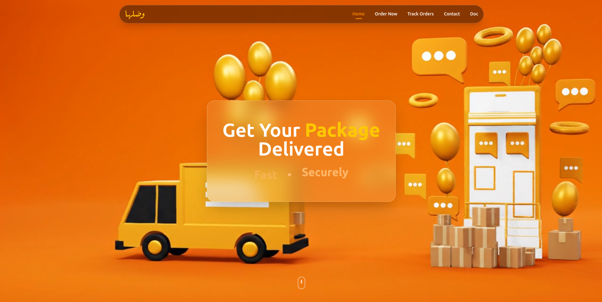
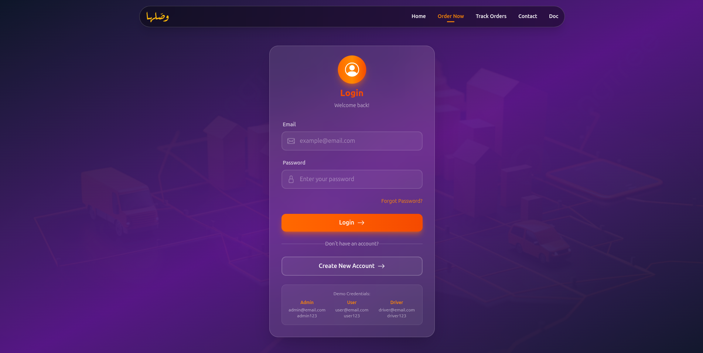
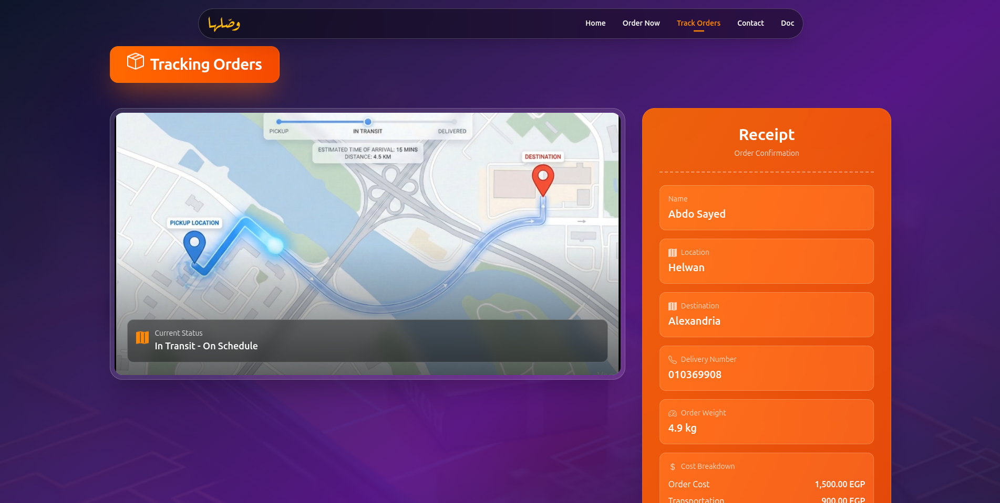

# Wasslha Logistics UI

Frontend for a System Analysis course project that simulates a logistics workflow across three roles: `Admin`, `User`, and `Driver`.

## Overview

Waslah provides a demo delivery flow from order placement to tracking:
- User places an order.
- Admin reviews and manages operations.
- Driver accepts and updates delivery progress.
- User tracks the order and views a receipt-style summary.

## Screenshots

### Home Page



- Brand-led hero section with delivery-focused visual language.
- Primary navigation to `Order Now`, `Track Orders`, `Contact`, and `Doc`.

### Login Page



- Role-based demo login screen.
- Glassmorphism card UI with gradient background.
- Direct path to account creation.

### Track Orders Page



- Split layout with tracking map and receipt panel.
- Delivery status timeline and cost breakdown preview.

## Demo Credentials

Use these credentials on `/login`:

| Role | Email | Password | Redirect |
| --- | --- | --- | --- |
| Admin | `admin@email.com` | `admin123` | `/admin` |
| User | `user@email.com` | `user123` | `/placedorder` |
| Driver | `driver@email.com` | `driver123` | `/driver` |

## Available Routes

- `/` - Home
- `/login` - Login
- `/register` - Register
- `/placedorder` - Place order form
- `/vieworder` - Order review
- `/track` - Tracking and receipt view
- `/admin` - Admin dashboard
- `/managestatus` - Status management
- `/managedriver` - Driver assignment
- `/managecustomers` - Customer management
- `/driver` - Driver dashboard
- `/acceptedorders` - Driver accepted orders
- `/about` - About
- `/doc` - Documentation
- `/contact` - Contact

## Tech Stack

- React 19
- React Router DOM 7
- Tailwind CSS 4
- Framer Motion
- GSAP
- Vite

## Local Development

```bash
npm install
npm run dev
```

Build production assets:

```bash
npm run build
npm run preview
```
